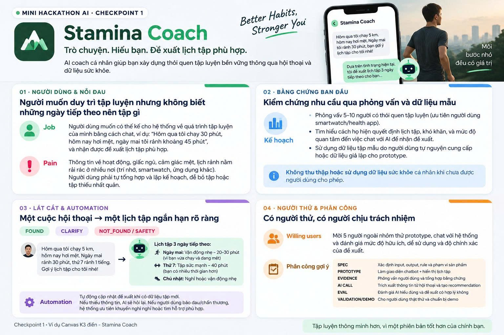

# Canvas — Stamina Coach

**Mini Hackathon AI · Checkpoint 1 · Nhóm CSUI · Phòng E403**

[Xem ảnh Canvas gốc](assets/stamina-coach-canvas.png).

> **Trò chuyện. Hiểu bạn. Đề xuất lịch tập phù hợp.**
>
> Better Habits, Stronger You — Mỗi bước nhỏ đều có giá trị.

Stamina Coach là ý tưởng AI coach cá nhân giúp người dùng xây dựng thói quen tập luyện bền vững thông qua hội thoại và dữ liệu sức khỏe do người dùng cho phép sử dụng. Người dùng kể lại quá trình tập luyện, tình trạng hiện tại và thời gian rảnh; hệ thống dùng thông tin đó để đề xuất lịch tập ngắn hạn phù hợp, kèm lý do dễ hiểu.

Tài liệu này diễn giải nội dung Canvas trong ảnh tham khảo được cung cấp cho dự án. Các mục phỏng vấn, thử nghiệm và tự động cập nhật bên dưới là kế hoạch hoặc hành vi dự kiến, chưa phải kết quả đã kiểm chứng hay xác nhận tính năng đã triển khai. Phạm vi prototype hiện tại được mô tả trong [AI Spec](spec.md).

## 01 · Người dùng & nỗi đau

### Người dùng mục tiêu

Người muốn duy trì tập luyện nhưng không biết những ngày tiếp theo nên tập gì, đặc biệt khi cần cân bằng giữa lịch sinh hoạt, mức độ mệt và hoạt động đã thực hiện.

### Job — Việc người dùng muốn làm

Người dùng muốn kể cho hệ thống về quá trình tập luyện của mình bằng cách chat, ví dụ:

> “Hôm qua tôi chạy 30 phút, hôm nay hơi mệt, ngày mai tôi rảnh khoảng 45 phút.”

Từ cuộc trò chuyện, người dùng nhận được đề xuất lịch tập phù hợp với tình trạng và quỹ thời gian của mình.

### Pain — Khó khăn hiện tại

- Thông tin về hoạt động, giấc ngủ, cảm giác mệt và lịch rảnh nằm rải rác ở nhiều nơi: trí nhớ, smartwatch hoặc các ứng dụng khác.
- Người dùng phải tự tổng hợp thông tin và tự lập kế hoạch cho những ngày tiếp theo.
- Việc này khiến họ dễ bỏ tập hoặc duy trì lịch tập thiếu nhất quán.

## 02 · Bằng chứng ban đầu

**Hướng kiểm chứng:** tìm hiểu nhu cầu qua phỏng vấn và dữ liệu tập mẫu. Ảnh Canvas mới nêu kế hoạch, chưa cung cấp kết quả phỏng vấn hay dữ liệu xác nhận nhu cầu.

| Hoạt động dự kiến | Nội dung |
|---|---|
| Phỏng vấn 5–10 người có thói quen tập luyện | Ưu tiên người đang dùng smartwatch hoặc ứng dụng sức khỏe. |
| Tìm hiểu cách quyết định lịch tập | Hỏi về cách họ chọn buổi tập tiếp theo, khó khăn đang gặp và mức độ quan tâm đến việc chat với AI để nhận đề xuất. |
| Thử với dữ liệu mẫu | Dùng dữ liệu tập do người dùng tự nguyện cung cấp hoặc dữ liệu giả lập cho prototype. |

**Nguyên tắc dữ liệu trong Canvas:** không thu thập hoặc sử dụng dữ liệu sức khỏe cá nhân khi chưa được người dùng cho phép.

Khi có kết quả thử nghiệm, ghi nhận bằng chứng thực tế tại [validation/](validation/README.md).

## 03 · Lát cắt & automation

### Một cuộc hội thoại → một lịch tập ngắn hạn rõ ràng

Lát cắt sản phẩm trong Canvas là cuộc trò chuyện giúp hệ thống hiểu hoạt động gần đây, trạng thái hiện tại và thời gian rảnh, rồi đề xuất lịch tập cho 3 ngày tiếp theo.

**Ví dụ đầu vào trong Canvas:**

> “Hôm qua tôi chạy 5 km, hôm nay hơi mệt. Ngày mai rảnh 30 phút, thứ 7 rảnh 1 tiếng. Gợi ý lịch tập cho tôi nhé!”

**Ví dụ đầu ra minh họa trong Canvas:**

| Ngày | Đề xuất | Giải thích trong ví dụ |
|---|---|---|
| Ngày mai | Vận động nhẹ — 20–30 phút | Vì người dùng vừa chạy và đang mệt. |
| Thứ 7 | Tập sức mạnh — 40 phút | Vì người dùng có nhiều thời gian hơn. |
| Chủ nhật | Nghỉ hoặc vận động nhẹ | — |

Đây là ví dụ minh họa ý tưởng sản phẩm trong ảnh, chưa phải lịch tập được sinh và kiểm chứng bởi prototype.

### Các nhánh phản hồi

Canvas nêu ba nhãn phản hồi; ý nghĩa được diễn giải theo luồng hội thoại như sau:

| Nhánh | Hành vi dự kiến |
|---|---|
| `FOUND` | Khi thông tin đủ để đề xuất, trả lịch tập ngắn hạn rõ ràng, phù hợp với bối cảnh người dùng đã cung cấp. |
| `CLARIFY` | Khi thiếu thông tin cần thiết, hỏi lại người dùng trước khi hoàn thiện đề xuất. |
| `NOT_FOUND / SAFETY` | Khi chưa thể đưa ra đề xuất phù hợp hoặc có vấn đề an toàn, nêu giới hạn; nếu người dùng báo đau hoặc chấn thương, ưu tiên khuyến nghị nghỉ hoặc tìm hỗ trợ phù hợp. |

### Automation dự kiến

- Tự động cập nhật đề xuất khi có dữ liệu tập mới.
- Nếu thiếu thông tin, AI hỏi lại để làm rõ.
- Nếu người dùng báo đau hoặc chấn thương, hệ thống ưu tiên khuyến nghị nghỉ hoặc tìm hỗ trợ phù hợp.

Đây là hành vi mong muốn của sản phẩm; Canvas chưa xác định cơ chế kết nối smartwatch hay tự động đồng bộ dữ liệu sức khỏe.

## 04 · Người thử & phân công

### Willing users — Kế hoạch mời người thử

Mời **5 người ngoài nhóm** dùng thử prototype, chat với hệ thống và đánh giá:

- Mức độ hữu ích của đề xuất.
- Mức độ dễ sử dụng của trải nghiệm hội thoại.
- Độ chính xác của đề xuất theo đánh giá của người thử.

Đây là số người dự kiến mời, chưa phải số người đã đồng ý hoặc đã tham gia. Nhật ký và phản hồi thực tế sẽ được ghi tại [validation/user_testing_log.md](validation/user_testing_log.md).

### Phân công gợi ý theo Canvas

| Hạng mục | Công việc |
|---|---|
| SPEC | Xác định input, output, rule và phạm vi sản phẩm. |
| PROTOTYPE | Làm giao diện chatbot và hiển thị lịch tập. |
| EVIDENCE | Phỏng vấn người dùng và tổng hợp bằng chứng. |
| AI CALL | Trích xuất thông tin từ hội thoại và tạo đề xuất. |
| EVAL | Đánh giá AI hiểu đúng thông tin và đề xuất có hợp lý không. |
| VALIDATION/DEMO | Cho người dùng thật dùng thử và chuẩn bị demo. |

Tên thành viên và phân công thực tế được quản lý tại [TEAMMATES.md](TEAMMATES.md) và [bảng phân công trong README](README.md#2-bảng-phân-công-vai-trò-đối-chiếu-điểm).

## Đối chiếu với phạm vi prototype hiện tại

| Nội dung | Định hướng Canvas | Phạm vi mô tả trong AI Spec hiện tại |
|---|---|---|
| Cách nhập thông tin | Hội thoại về buổi tập gần đây, mức độ mệt và thời gian rảnh. | Profile qua form/CLI: trình độ, mục tiêu, số buổi và ràng buộc. |
| Kết quả chính | Lịch tập ngắn hạn; ví dụ minh họa là 3 ngày tiếp theo. | Giáo án tuần (`weekly_plan`) cùng ghi chú an toàn và lời động viên. |
| Điều chỉnh đề xuất | Hỏi lại khi thiếu thông tin, cập nhật khi có dữ liệu tập mới. | Luồng điều chỉnh bằng ràng buộc mới khi mệt/đau được mô tả trong spec. |
| Dữ liệu sức khỏe | Dữ liệu người dùng cho phép sử dụng hoặc dữ liệu giả lập để thử nghiệm. | Spec nêu giới hạn chưa cá nhân hóa theo dữ liệu wearable. |

Canvas bổ sung bối cảnh sản phẩm cho [spec.md](spec.md), không thay thế phạm vi và quality bar đã ghi trong đó. Trạng thái chạy thật/mẫu được mô tả tại [codebase/README.md](codebase/README.md) và [codebase/MOCK.md](codebase/MOCK.md).

> Tập luyện thông minh hơn, vì một phiên bản tốt hơn của chính bạn.
